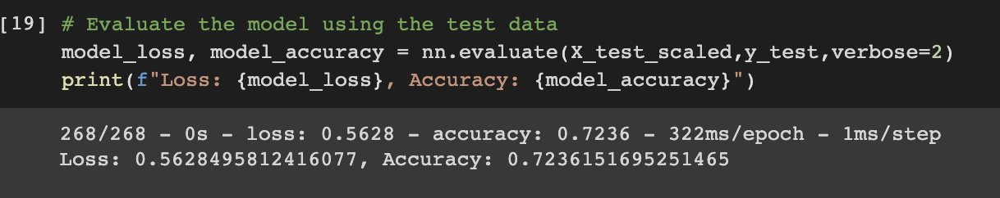

# Neural_Network_Charity_Analysis

## Overview of the analysis
This project aims to use machine learning and neural networks to create a binary classifier that is capable of predicting whether applicants will be successful if funded by Alphabet Soup. The dataset contains more than 34,000 organizations that have received funding from Alphabet Soup over the years. 

Source of Data: charity_data.csv

### Tools used
Google Collab, Pandas and the Scikit-Learn
- Preprocessing phase- StandarsScaler()
- Compiling, training and evaluation phase- TensorFlow
- Model optimization phase- TensorFlow

## Results

### Data preprocessing for neural network
- Target(s)- IS_SUCCESSFUL
- Features - APPLICATION_TYPE, AFFILIATION, CLASSIFICATION, USE_CASE, ORGANIZATION, STATUS, INCOME_AMT, SPECIAL_CONSIDERATIONS, ASK_AMT
- Variables dropped from input data- EIN and NAME
- Preprocessed dataframe

### Compile, Train, and Evaluate the Model
- For this neural network model, two hidden layers are used. First layer has 8 neurons and second layer has 5 neurons. The input layer uses relu activation function and output layer uses sigmoid activation function.

- The model is not able to achieve target model performance of 75% accuracy. The accuracy of the model is 70% and the loss is 58.7%.

###  Optimize the model to increase its performance
#### 1st attempt:
- Increase the number of bin for 'CLASSIFICATION' and 'APPLICATION_TYPE'
- Increase the number of neuron in first hidden layer from 8 to 100 and in second hidden layer from 5 to 40
- The model accuracy increased to 72.53% and loss decreased to 56.23%

#### 2nd attempt:
- Drop the variable 'USE_CASE'
- Add one additional hidden layer 

- The model accuracy slightly decreased to 72.38% and loss increased to 56.62%

#### 3rd attempt:
- Remove the additional layer
- Change the activation function from relu to tanh
- Reduce the number of neuron for 1st hidden layer from 100 to 80 and 2nd hidden layer from 40 to 30
- The model accuracy is 72.36% and loss is 56.28%

## Summary
The deep learning neural network model could not achieve the performance target accuracy of 75%. The optimization model slightly imporved the performance of the model to 72% but it could not reach the target. Considering that low target level, we can say that this model is not the best fit. The alternative model like Random Forest Classifier can be used to fit a number of decision tree classifiers on various sub-samples of the dataset and use averaging to improve the predictive accuracy.

